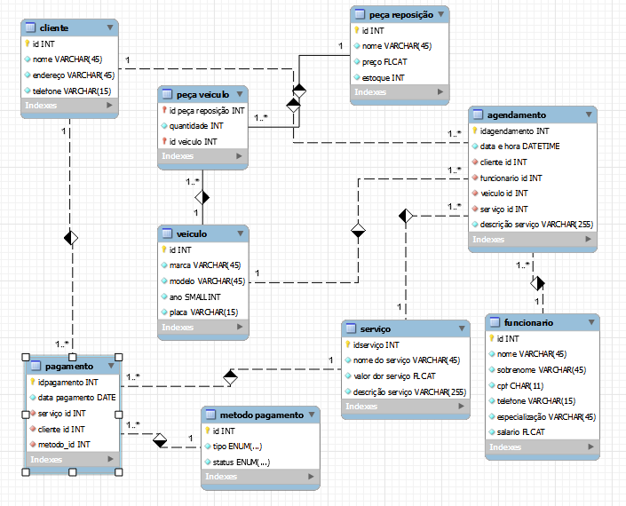

# PROJETO MODELAGEM DE BANCO DE DADOS | E-COMMERCE

## Projeto desenvolvido durando Bootcamp na [DIO](https://web.dio.me/)   

 

Potência Tech powered by iFood | Ciência de Dados

 

## Modelo de entidade de relacionamento:

